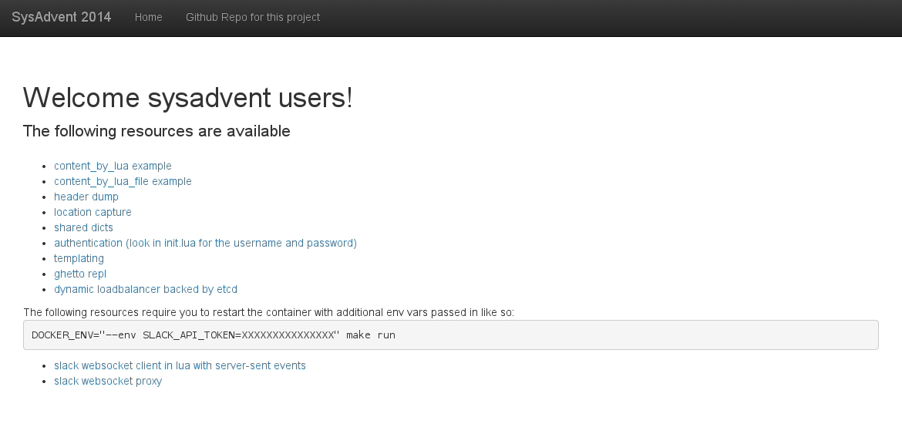
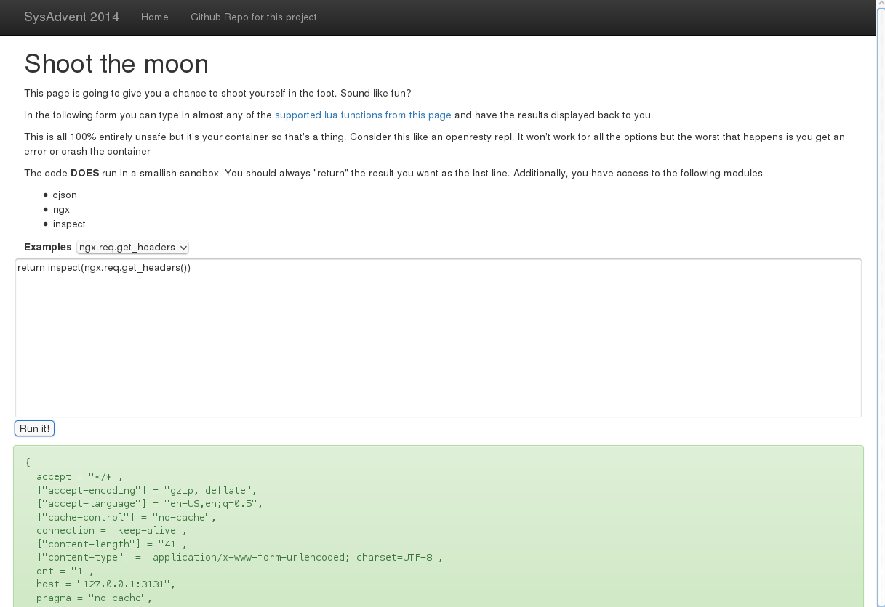
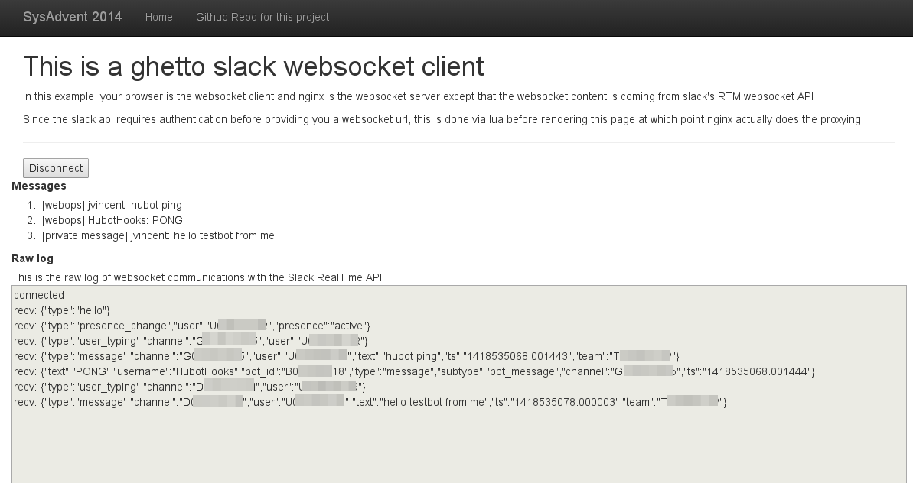

I have had the privilege of writing a post for SysAdvent for the past several years. In general these posts have been focused on broader cultural issues. This year I wanted to do something more technical and this topic gave me a chance to do that. It's also just REALLY cool so there's that.

# Nginx
I'm sure most people are familiar with Nginx but I'm going to provide a small history anyway. Nginx is a webserver created by Igor Sysoev around 2002 to address the [C10K problem](http://www.kegel.com/c10k.html).
The C10K problem isn't really a "problem" anymore in the sense that is was originally. It's morphed into the [C10M problem](http://c10m.robertgraham.com/p/manifesto.html). With the rise of the sensors, we may be dealing with a Cgazillion problem before we know it.

Nginx addressed this largely with an event loop (I know some folks think the event loop was invented in 2009). The dominant webserver at the time (and still), Apache, used a model of spawning a new process or a new thread for each connection. Nginx did it differently in that it spawned a master process (handles configuration, launching worker threads and the like) and a pool of workers each with their own event loop. Workers share no state between each other and select from a shared socket to process requests. This particular model works and scales very well. There's more on the history of Nginx in its section in the second edition of [AOSA](http://www.aosabook.org/en/nginx.html). It's a good read and while not 100% current, the basics are unchanged.

# Lua
Lua is a programming language invented in 1993. The title of this article is a shout out to how underappreciated Lua is not only as a language but in its myriad uses. Most people who have heard of Lua know it as the language used for World of Warcraft plugins.

Lua is an interesting language. Anyone with experience in Ruby will likely find themselves picking it up very quickly. It has a very small core language, first-class functions and coroutines. It is dynamically typed and has one native data structure - the table. When you work in Lua, you will learn to love and appreciate the power of tables. They feel a lot like a ruby hash and are the foundation of most advanced Lua. 

It has no classes but they can be implemented after a fashion using tables. Since Lua has first-class functions, you can create a "class" by lumping data and function into a table. There's no inheritence but instead you have prototypes. There's a bit of syntatic sugar to help you out when working with these objects. Inheritence is handled via the metatable.

For a good read on the language history
- [Wikipedia](http://en.wikipedia.org/wiki/Lua_(programming_language))
- [Lua website](http://www.lua.org/history.html)

For some basics on the language itself, the wikipedia article has code sample and also the [official documentation](http://www.lua.org/manual/5.2/). There is also a section on Lua in the newest edition of the Seven Languages series - [Seven More Languages in Seven Weeks](https://pragprog.com/book/7lang/seven-more-languages-in-seven-weeks)

# Combining the two
As I mentioned, Lua is an easily embeddable language. I've been unable to find a date on when Lua support was added to Nginx but it was a very early version.

One of the pain points of Nginx is that it doesn't support dynamically loaded modules. All extended functionality outside the core must be compiled in. Lua support in nginx made it so that you could add some advanced functionality to nginx via Lua that would normally require a C module and a recompile. Much of the nginx api itself is exposed to lua directly and Lua can be used at multiple places in the Nginx workflow. You can:

- modify request or response headers via Lua
- create rewrite rules via Lua.
- create content itself via Lua. 

All of these are [documented](http://wiki.nginx.org/HttpLuaModule#Nginx_API_for_Lua) on the nginx website. 
For example, if I wanted to have the response body be entirely created by lua, I could do the following in nginx:

```
      location /foo {
        content_by_lua '
	ngx.header.content_type = 'text/plain'
        local username = "bob"
        ngx.say("hello ", username)
        ngx.exit(ngx.HTTP_OK)
        '
      }
```

which would return `hello bob` as plain text to your browser when you requested `/foo` from nginx.
Obviously escaping could get to be a headache here so most of the `*_by_lua` directives (which is for inlined lua code in the nginx config files) can be replaced with a `*_by_lua_file` where the lua code is stored in an external file.

Some other neat tricks you have available are using the cosocket api where you can actually open arbitrary non-blocking network connections from lua inside an Nginx worker.

As you can see, this is pretty powerful. Additionally the Lua functionality is provided in nginx via a project called [LuaJIT](http://luajit.org/luajit.html) which offers amazing speed and predicatable performance. By default, lua code is cached in nginx but this can be disabled at run-time to help speed up the development process.

# Enter the openresty
If it wasn't clear yet, the combination of nginx and lua basically gives you an application server right in the nginx core. Others have created lua modules specifically for use within Nginx and a few years ago an enterprising soul started bundling them up into something called [OpenResty](http://openresty.org/#About).

OpenResty combines checkpointed versions of Nginx, modified versions of the lua module (largely maintained by the OpenResty folks anyway), curated versions of LuaJIT and a boatload of nginx-specific lua modules into a single distribution. OpenResty builds of nginx can be used anywhere out-of-the-box that you would use a non-lua version of Nginx. Currently openresty is sponsored by CloudFlare where the primary author, Yichun Zhang (who prefers to go by "agentzh" everywhere) is employed.

OpenResty is a pretty straightforward "configure/make/make install" beast. There is a slightly dated omnibus project on Github [from my friend Brian Akins](https://github.com/bakins/omnibus-nginx) that we've contributed to in the past and will be contributing our current changes back to in the future. Much of my appreciation and knowledge of lua and openresty comes directly from Brian and his omnibus packages are how I got started.

# But nobody builds system packages anymore
Obviously system packages are the domain of greyhaired BOFHs who think servers are for serving. Since we're all refined and there are buzzword quotas to be maintained, you should probably just use Docker (but you have to say it like Benny says "Spaceship").

Seriously though, Docker as a packaging format is pretty neato and for what I wanted to do, Docker was the best route. To that end I give you [an openresty tutorial in a box (well, a container)](https://github.com/lusis/sysadvent-2014).

The purpose of this repo is to help you get your feet wet with some examples of using lua with Nginx via the latest OpenResty build. It ships with a Makefile to wrap up all the docker invocations and hopefully make things dead simple. It works its way up from the basics I've described all the way to communicating between workers via a shared dictionary, making remote API calls to Github, two Slack chat websocket "clients" and the skeleton of a dynamic load balancer in Nginx backed by etcd:



In addition, because I know how difficult it can be to develop and troubleshoot against code running inside nginx I've created a web based [repl](http://en.wikipedia.org/wiki/Read%E2%80%93eval%E2%80%93print_loop) for testing out and experimenting with the Nginx lua API:



To use the basic examples in the container, you can simply clone the repo and run `make all`. This will build the container and then start OpenResty listening on port 3131. The directory `var_nginx` will be mounted inside the container as `/var/nginx` and contains all the neccessary config files and lua code for you to poke/prod/experiment with. Logs will be written to `var_nginx/logs` so you can tail them if you'd like. As you can see it also uses Bootstrap for the UI so we've pretty much rounded out the ["what the hell have you built" graph.](https://twitter.com/codinghorror/status/347070841059692545)

## Advanced examples
If you'd like to work with the Slack or etcd examples, you'll need to generate a slack "bot" integration token for use or stand up an etcd instance respectively. The Makefile includes support for running an etcd container appropriate for use with the tutorial container. If you aren't a Slack user then here's a screenshot so you can see what it WOULD look like:



# Wrap up
Maybe this post has inspired you to at least take a look at OpenResty. Lua is a really neat language and very easy to pick up and add to your toolbelt. We use OpenResty builds of Nginx in many places internally from proxy servers to even powering our own internal SSO system based on Github Oauth and group memeberships. While most people simply use Nginx as a proxy and static content service, we treat it like an application server and leverage the flexibility of not requiring another microservice to handle certain tasks...in addition to using it as a proxy and static content service. This post and the accompanying code has been a blast to create and I hope it helps you in some small way.
